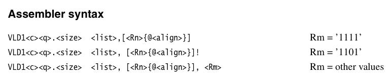

# Main-stream Platform ABIs and function-calling conventions on most of Processor Architectures and Operating Systems
各主流处理器与系统平台的ABI和函数调用约定，外加系统平台预定义的宏

<br />

## 汇编语言相关

- [Using as——The GNU Assembler](http://ftp.gnu.org/old-gnu/Manuals/gas-2.9.1/html_chapter/as_toc.html)
- [AT&T Syntax versus Intel Syntax](http://ftp.gnu.org/old-gnu/Manuals/gas-2.9.1/html_chapter/as_16.html#SEC198)
- [Oracle Solaris x86 Assembly Language Reference Manual](https://docs.oracle.com/cd/E36784_01/html/E36859/enmzx.html#scrolltoc)
- In GNU Assembly Language, use Intel syntax for x86 ISA: `.intel_syntax noprefix`
- In GNU Assembly Language, use AT&T syntax for x86 ISA: `.att_syntax`
- GNU Assembler for ARMv7, use Thumb2 instruction set: `.syntax unified` 
- [Understanding this part arm assembly code](https://stackoverflow.com/questions/22396214/understanding-this-part-arm-assembly-code)
- [Useful assembler directives and macros for the GNU assembler](https://community.arm.com/arm-community-blogs/b/architectures-and-processors-blog/posts/useful-assembler-directives-and-macros-for-the-gnu-assembler)
- [Microsoft Macro Assembler reference](https://docs.microsoft.com/en-us/cpp/assembler/masm/microsoft-macro-assembler-reference)
- [一编关于MASM宏macro的用法](https://blog.csdn.net/G_Spider/article/details/6368373)
- [NASM中的多行宏定义:"%macro"](https://blog.csdn.net/yuduoluogongwu/article/details/7409576)
- [Intel x87 FPU的使用基础](https://blog.csdn.net/zenny_chen/article/details/121045282)

<br />

## 各大平台的ABI与函数调用约定

- [System V ABI](https://wiki.osdev.org/System_V_ABI)
- [MSVC上的函数调用约定](https://docs.microsoft.com/en-us/search/index?search=calling%20convention)：“The x64 ABI considers registers RBX, RBP, RDI, RSI, RSP, R12, R13, R14, R15, and XMM6-XMM15 nonvolatile. They must be saved and restored by a function that uses them.”——这意味着，对于AVX以及AVX-512，YMM6-YMM15以及ZMM6-ZMM15的低128位是非挥发的，需要被当前函数保存，而其他部分则是易挥发的，不需要被当前函数保存。
- [Procedure Call Standard for the Arm® Architecture](https://developer.arm.com/docs/ihi0042/i/procedure-call-standard-for-the-arm-architecture-abi-2019q4-documentation)
- [Procedure Call Standard for the Arm® 64-bit Architecture](https://developer.arm.com/docs/ihi0055/d/procedure-call-standard-for-the-arm-64-bit-architecture)
- [Procedure Call Standard for the ARM® 64-bit Architecture (AArch64) with SVE support](https://developer.arm.com/docs/100986/latest/procedure-call-standard-for-the-arm-64-bit-architecture-aarch64-with-sve-support)
- [RISC-V Assembly Programmer's Manual](https://github.com/riscv-non-isa/riscv-asm-manual/blob/master/riscv-asm.md)
- [Cx51函数声明与调用约定](http://www.keil.com/support/man/docs/c51/c51_le_funcdecls.htm)（在Keil Cx51中，针对中断例程使用`using`指定寄存器段是无效的，`using`只作用于一般C函数。）
- **PLT**: Procedure Linkage Table
- **PIC**: Position-Independent code
- **GOT**: Global Offset Table

<br />

## 各大平台的预定义宏

- [各处理器架构的预定义宏](https://sourceforge.net/p/predef/wiki/Architectures/)
- [各操作系统的预定义宏](https://sourceforge.net/p/predef/wiki/OperatingSystems/)
- [各大编译器预定义宏](https://sourceforge.net/p/predef/wiki/Compilers/)（此外，微软的Clang加MS CodeGen后端编译器也同样支持 **_MSC_VER** 预定义宏。）
- [Unix平台标准预定义宏](https://sourceforge.net/p/predef/wiki/Standards/)
- [ARMv8 - ARM](https://en.wikichip.org/wiki/arm/armv8)
- 在与GNU C兼容的编译工具链中，`__cplusplus`宏表示当前的编译器为C++；`__OBJC__`宏表示当前的编译器为Objective-C；`__ASSEMBLER__`宏表示当前使用的是汇编器。
- [Microsoft Predefined macros](https://learn.microsoft.com/en-us/cpp/preprocessor/predefined-macros)
- [/Zc:__cplusplus \(Enable updated __cplusplus macro\)](https://learn.microsoft.com/en-us/cpp/build/reference/zc-cplusplus)

<br />

#### 在Apple环境下针对Apple A处理器架构的一些额外的预定义宏

首先，在所有Apple系统环境下一定有预定义宏——**`__APPLE__`**。

1. 列出指定架构的所有预定义宏：`clang -arch <架构名> -E -dM - < /dev/null`。其中 *<架构名>* 目前支持：`armv5`、`armv6`、`armv7`、`armv7s`、`arm64`。除此之外，当前macOS平台上Xcode自带的Apple LLVM编译器还支持这些架构：`i386`、`x86_64`、`ppc`、`ppc64`。
1. Apple平台下，除了支持`__ARM_ARCH_'V'__`这个标准的架构预定义宏之外，还支持`__ARM_ARCH`这个宏，这个宏后面跟着一个整数，指明当前ARM架构的大版本。比如，5表示ARMv5，8则表示ARM64。
1. Apple平台下，如果当前Apple A处理器是arm64架构的话，那么它不仅支持`__aarch64__`这个标准的宏，而且还支持`__arm64__`这个宏。
1. armv7s的版本预定义宏为：`__ARM_ARCH_7S__`。
1. arm64e架构的预定义宏为：`__arm64e__`。arm64e默认是不被构建的，当前Xcode 10的默认标准架构只有`armv7`和`arm64`这两种。如果要额外添加的话需要在编译构建选项列表中的**Architectures**一栏中**追加**`arm64e`才行。

<br />

#### 在Android系统环境下指定处理器架构

首先，在Android环境下一定有预定义宏——**`__ANDROID__`**。

由于ARMv8-A架构有多个变种，比如ARMv8、ARMv8.1、ARMv8.2、ARMv8.3、ARMv8.4等等。为了能在NDK编译环境中指定架构名，我们可以用 `-march=`命令行选项。
比如：`-march=armv8.2-a`指定使用ARMv8.2-A架构。

在基于ARM64的Linux下要使用半精度浮点相关的指令集，需要在汇编语言中指定ARMv8.2-A架构外加FP16，如下所示：
```cmake
set(CMAKE_ASM_FLAGS "-march=armv8.2-a+fp16 ${CMAKE_ASM_FLAGS}")
```

<br />

#### MSVC下对各个处理器平台的宏定义

- x86: `_M_IX86`
- x86_64: `_M_X64`
- ARM: `_M_ARM`
- ARM64: `_M_ARM64`

<br />

## 各编译器预定义的项目工程相关的预定义宏

- Visual Studio：`$(LocalDebuggerWorkingDirectory)`表示当前工程中用于存放源文件的主目录。`$(WindowsSDK_IncludePath)`表示Windows Kit目录下的include目录下的um目录。`$(WindowsSDK_LibraryPath_x64)`表示Windows Kit目录下的Lib目录下的x64目录。查看更多的宏名可在Visual Studio中选择C/C++一栏下的“常规”，然后点击“附加包含目录”，再点击“编辑”即可。
- Xcode：`$(SRCROOT)`表示当前项目工程的根目录。`$(PROJECT_DIR)`所表示的工程路径与`$(SRCROOT)`一样。`$(PROJECT_NAME)`表示当前项目名称。
- [cmake-variables(7)](https://cmake.org/cmake/help/latest/manual/cmake-variables.7.html)
- CMake：`${PROJECT_SOURCE_DIR}`表示当前工程项目中用于存放源文件的主目录。在Android Studio中则是当前项目工程根目录下的 **`app/src/main/cpp/`** 目录。在Android Studio的cmake中，`${ANDROID_ABI}`表示当前正在编译的ABI架构名称。
- Eclipse下使用`workspace_loc`来表示当前Eclipse的工作目录。如果要指定当前工作目录下某个项目的src文件夹路径，则可使用：`"${workspace_loc:/project_name}/src"`。

<br />

## 各平台汇编语言写法

- MASM x86

```nasm
; 汇编源文件func.asm

.model flat
.code

_CFunc   proc public

    mov     eax, [esp + 4]    ; EAX存放第一个参数
    mov     ecx, [esp + 8]    ; ECX存放第二个参数
    sub     eax, ecx
    ret

_CFunc   endp


_CFunc2     proc public

    mov     edx, 12345678H    ; 存放高4字节
    mov     eax, 90abcdefH    ; 存放低4字节
    ret

_CFunc2     endp


_CFunc3     proc public

    push    40          ; 给成员d赋值
    push    30          ; 给成员c赋值
    push    20          ; 给成员b赋值
    push    10          ; 给成员a赋值
    mov     eax, esp    ; 将当前栈指针赋给EAX作为所返回结构体对象的起始地址
    add     esp, 16     ; 将栈指针恢复到返回地址处
    ret

_CFunc3     endp


@FastFunc@16   proc public

    mov     eax, ecx
    sub     eax, edx
    mov     ecx, [esp + 4]
    mov     edx, [esp + 8]
    sub     ecx, edx
    sub     eax, ecx

    ; 这里用ret 8是将压栈的两个参数在函数返回后直接推出栈
    ; 相当于： ret;    add esp, 8;
    ret     8

@FastFunc@16   endp

end

```

- MASM x86-64

```nasm
.code

; int MyNativeSub(int a, int b);

MyNativeSub     proc export

    sub     ecx, edx
    mov     eax, ecx
    ret

MyNativeSub endp

end
```

- MASM arm64

```nasm
; int MyNativeSub(int a, int b);

MyNativeSub     proc export

    sub     w0, w0, w1
    ret

    endp

end
```

- GAS x86-64

```nasm
.text
.align 4
.intel_syntax noprefix
 
.globl MyASMTest
 
MyASMTest:
 
    sub     edi, esi
    mov     eax, edi
    ret
```

- GAS arm64

```nasm
.text
.align 4
 
.globl MyASMTest
 
MyASMTest:
 
    sub     w0, w0, w1
    ret
```

- NASM x86-64

```nasm
; 这是一个汇编文件
; YASM的注释风格使用分号形式
 
global MyASMTest
 
section .text

bits 64
 
MyASMTest:
 
    sub     edi, esi
    mov     eax, edi
    ret
```

<br />

## GAS局部跳转标签

GAS中的局部跳转标签又称为**局部符号名**（ **Local Symbol Name** ），用于帮助编译器和程序员临时地使用名字。这个对于内联汇编以及汇编中的宏里使用跳转标签的场合会显得格外有用。GAS中提供了10个局部符号名，分别是数字 **`0`** 到 **`9`**。要引用最近先前已经定义好的符号，使用 **`Nb`** 这种形式。要引用一个临时符号的下一个定义，写作为 **`Nf`**。这里的 **N** 即表示所定义的临时符号名。而f代表“forwards”，b则代表“backwards”。

至于你如何使用这些局部标签，没有什么约束。但记住，在汇编文件中的任一点，你只能引用最多10个前向局部标签以及最多10个后向局部标签。

局部标签名仅仅是个符号设备。在汇编器使用它们之前，它们会立即被变换为更为常规的符号。这些符号名被存放在符号表中，将会随着错误消息以及可选地发射到含有这些部分的目标文件中：
- L：所有局部标签会以“L”打头。
- 数字：局部标签名。
- C-A：包含不寻常的字符。
- 序数：这是一个序列号以保证标签的唯一性。

例如，第一个 `1:` 可能被命名为：“L1C-A1”；第44个 `3:` 可能被命名为：“L3C-A44”。

下面举一个x86-64汇编代码的例子：

```nasm
.text
.align 4
.intel_syntax noprefix

.globl ASMTest

// uint ASMTest(uint arg)
ASMTest:

    mov     ecx, edi
    xor     eax, eax
    
0:
    inc     eax
    dec     ecx
    jnz     0b
    
    cmp     eax, 0
    je      0f
    
1:
    dec     eax
    dec     edi
    jnz     1b
    
    cmp     eax, 0
    je      1f
    
0:
    add     eax, 10
    
1:
    add     eax, 100
    
    ret
```

对上述代码调用 `ASMTest(10)` 的结果为100。

<br />

## MASM中使用局部跳转标签

MASM中的局部跳转标签用法与GAS类似，只不过它不像GAS里有10种命名，它只有一种，即：**`@@:`**。如果要向上引用局部标签，使用 **`@b`**；如果向下引用局部标签，使用 **`@f`**。下面举一个实际例子：

```nasm
.code

; int ASMLabelTest(int a)
ASMLabelTest    proc public

    xor     eax, eax

@@:
    inc     eax
    dec     ecx
    jnz     @b

    test    eax, eax
    jne     @f

    add     eax, 10

@@:
    add     eax, 100
    ret

ASMLabelTest    endp

end
```

如果调用了 `ASMLabelTest(10)`，那么结果为110。

<br />

## 关于x86平台下的栈帧

在x86以及x86-64执行环境下，有不少系统函数会对当前栈帧进行检查或甚至会将某些临时变量分配到我们当前调用函数的栈帧中，尤其是可变参数个数的系统函数调用（比如`printf`）。此时，我们就需要在自己当前函数中空出一定的栈空间作为栈帧，供给被调函数使用，同时也需要将 **`RBP`** 寄存器进行保存。比如以下代码：

```c
#include <stdio.h>

extern void ASMCallFunction(void (*pFunc)(int, int), int a, int b);

static void MyPrintSum(int a, int b)
{
    printf("Welcome to my C function! And the sum of a and b is: %d\n", a + b);
}

int main(void)
{
    ASMCallFunction(MyPrintSum, 10, 6);
}
```

上述代码中我们在main函数里调用的 **ASMCallFunction** 函数在以下asm文件中定义：

```nasm
.code

; void ASMCallFunction(void (*pFunc)(int, int), int a, int b)
ASMCallFunction     proc public

    push    rbp
    mov     rbp, rsp
    sub     rsp, 32

    mov     rax, rcx
    mov     ecx, edx
    mov     edx, r8d
    call    rax

    mov     rsp, rbp
    pop     rbp
    ret

ASMCallFunction     endp

end
```

从上述代码我们可以看到，我们在 **ASMCallFunction** 函数中保留了32个字节的栈空间作为栈帧。由于在MSVC的Release模式下执行上面程序时，留24个字节仍然不够，32个字节正好；而在Debug模式下16个字节也没问题。因此这里就选用了32个字节作为其栈空间。另外这里再提一下，x86-64的ABI中一般规定栈指针（RSP）的值应当至少为8字节对齐。

<br />

## NEON中采用对齐方式的VLD/VST

在ARM官方文档上给出的VLD系列的指令形式为——



而在ARM GCC中，若要使用对齐方式的话，照着上图的格式写，不管怎么写都不会正确。

下面将介绍在ARM GCC中正确使用对齐方式的NEON读写方法：
```nasm
.text
.align 4
.globl my_test

my_test:

    vld1.32 {d0}, [r0, :64]
    vst1.32 {d0}, [r1, :64]
    bx      lr
```
上述的对齐方式为64位，即8字节对齐。


